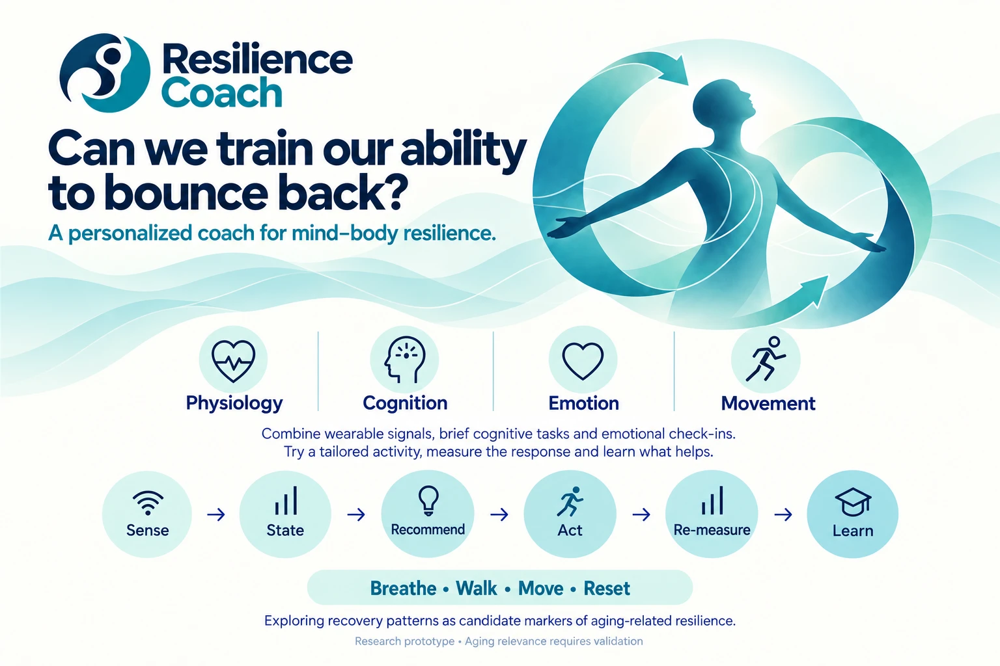

# ResilienceCoach
An AI Coach that uses wrist wearable data to track and coach

**Can we train our ability to bounce back?** ResilienceCoach is a local prototype for
measuring and coaching **mind-body resilience**: how four coupled domains react to a
challenge and recover, session after session.

- **Physiology:** heart rate and heart-rate variability from a wrist wearable
- **Cognition:** a brief reaction-time task
- **Emotion:** check-ins on stress, mood and energy
- **Movement:** wrist motion and activity context

Each session runs one loop: **sense → state → recommend → act → re-measure → learn**.
The person tries a small, safe activity (breathe, walk, move or reset), the response is
measured, and repeated sessions show what helps that person. Recovery patterns are being
explored as candidate markers of aging-related resilience. This is a research prototype,
and any aging relevance still needs validation.

Everything runs on your own computer. No cloud service is involved, and no data leaves
the machine.

## WHOOP Local

**WHOOP Local** (`whoop-web/`) is the sensing and session layer. It connects to a WHOOP 4.0
band over Bluetooth and serves a live dashboard in the browser:

- live heart rate, movement intensity (wrist accelerometer, ~104 Hz) and movement rhythm
- guided sessions with timed steps, markers and haptic cues on the band
- per-person profiles: resting and max HR learned from the data, plus age-predicted max HR
- every live record saved verbatim per session, with CSV and raw exports
- read-only sharing on the local network (`whoop.local`, passcode-protected)
- crash recovery: a supervisor restarts the server and resumes the open session


*An exercise calibration session: heart rate coloured by zone, with wrist movement
intensity (bars) and rhythm (dots) underneath. Phase markers run from baseline through
warm-up, build and peak to recovery. The phase table and the 60-second heart-rate
recovery are computed live.*

### Planned next

A **mind-body session**: check-in sliders, a reaction-time probe, a mild mental
challenge, then paced breathing, a mental reset or quiet rest, and a recovery phase in
which mind and body are both sampled. HRV is computed from the band's stored beat
intervals after the session.

## Setup (Windows)

```bash
git clone --recursive https://github.com/ilknuricke/ResilienceCoach.git
cd ResilienceCoach/whoop-web
py -3.11 -m venv .venv
.venv\Scripts\python -m pip install -r requirements.txt
```

Then double-click `whoop-web/start-lan.bat` (shared on the local network) or
`start.bat` (this PC only). `stop.bat` stops it. See [whoop-web/README.md](whoop-web/README.md)
for connecting the band, sessions, calibration and the data that is stored.

Close the WHOOP phone app (or turn off phone Bluetooth) before connecting. Only one
device can hold the band at a time.

## Layout

| Path | What |
| --- | --- |
| `whoop-web/server.py` | FastAPI + WebSocket server: band connection, sessions, profiles, sharing, recovery |
| `whoop-web/session.py` | Session engine: per-second features, markers, phase summaries, capture, exports |
| `whoop-web/supervise.py` | Keeps the server running and restarts it after any exit |
| `whoop-web/static/index.html` | The dashboard |
| `docs/images/` | Poster and screenshots |
| `openstrap-research/` | Git submodule: [OpenStrap/research](https://github.com/OpenStrap/research), the WHOOP 4.0 BLE protocol client (unmodified) |

## Data and privacy

Recordings, profiles and keys live in `whoop-web/data/`, which is git-ignored. Don't
commit it. It holds personal health data.

## Credits and disclaimer

The Bluetooth protocol client is [OpenStrap/research](https://github.com/OpenStrap/research)
(MIT). This project is not affiliated with, endorsed by, or connected to WHOOP. It is a
research prototype, not a medical device. It diagnoses nothing, and its numbers are not
WHOOP's scores.
